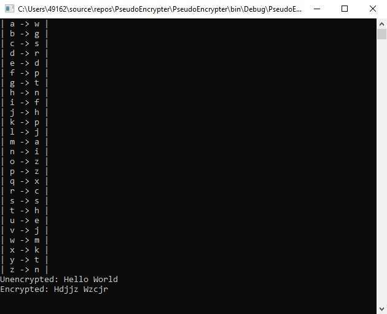

# PseudoEncrypter
This is a program to "encrypt" text. It assigns every character in the english alphabet a different random character from the alphabet. With the randomly generated character table you can "decrypt" the text.

